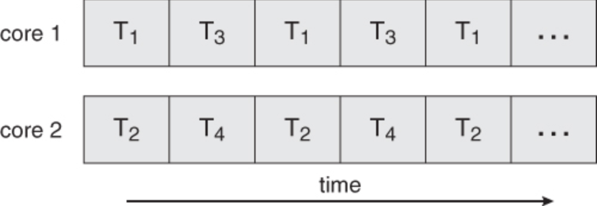

### Table of Contents

- **[Overview]**<br>
	* **[Ch1. Introduction](# Ch1. Introduction)**
	* **[Ch2. Operating System Structures](# Ch2. Operating System Structures)**<br>
- **[Process Management](#Process Management)**<br>
	* **[Ch3. Processes](## Ch3. Processes)**<br>
	* **[Ch4. Threads](## Ch4. Threads)**<br>
		+ **[4.1 Overview](### 4.1 Overview)**<br>
		+ **[4.2 Multicore Programming](### 4.2 Multicore Programming)**
		+ **[4.3 Multithreading Models](### 4.3 Multithreading Models)**
		+ **[4.4 Thread Libraries](### 4.4 Thread Libraries)**
	* **[Ch5. Process Synchronization](## Ch5. Process Synchronization)**
		+ **[5.1 Background](### 5.1 Background)**
		+ **[5.2 The Critical-Section Problem](### 5.2 The Critical-Section Problem)**
		+ **[5.3 Peterson's Solution](### 5.3 Peterson's Solution)**
		+ **[5.4 Synchronization Hardware](### 5.4 Synchronization Hardware)**
		+ **[5.5 Mutex Locks](### 5.5 Mutex Locks)**
		+ **[5.6 Semaphores](### 5.6 Semaphores)**
		+ **[5.7 Classic Problems of Synchronization](### 5.7 Classic Problems of Synchronization )**


	


# Overview
## Ch1. Introcution
## Ch2. Operating System Structures
# Process Management
## Ch3. Processes
## Ch4. Threads
### 4.1 Overview
1. Definition: A thread is a basic unit of CPU utilization, consisting of a program counter, a stack, and a set of registers, (and a thread ID.) Multithreaded process shares common code, data, and certain structures such as open files.

Figure 4.1 Single-threaded and multithreaded processes

2. Why threads?

	- Concurrency
	- Responsiveness
	- Resource sharing
	- Economy: Creating and managing threads( and context switches between them) is much faster than performing the same tasks for processes
	- Scalability

### 4.2 Multicore Programming

1. concurrency vs. parallism

Figure 4.2 Concurrency

Figure 4.3 Parallelism

2. Challenges
	
	- **Identifying tasks:** find activities that can be performed concurrently
	- **Balance:** find tasks to fun concurrently that provide equal value
	- **Data splitting:** prevent the threads from interfering with one another
	- **Data dependency:** if one task is dependent upon the results of another, then the tasks need to be synchronized.
	- **Testing and debugging**

3. Types of parallelism

	- **Data parallelism:** divide the data up amongst multiple cores and performs the same task on each subset of the data.
	- **Task parallelism:** divide the different tasks to be performed among the different cores and performs them simultaneously
	- **Hybrid of the two**

### 4.3 Multithreading Models
1. Types of threads: User threads and kernel threads
2. User thread -> Kernel thread Models

	- **Many-To-One Model**<br>
	Thread management is handled by the thread library in user space. However, if a blocking system call is made, then the entire process blocks.
	
		
	- **One-To-One Model**<br>
	The one-to-one model creates a separate kernel thread to handle each user thread. One-to-one model overcomes the problems listed above involving blocking system calls and the splitting of processes across multiple CPUs. However the overhead of managing the one-to-one model is more significant, involving more overhead and slowing down the system.
	
	- **Many-To-Many Model**<br>
	The many-to-many model multiplexes any number of user threads onto an equal or smaller number of kernel threads, combining the best features of the one-to-one and many-to-one models. Blocking kernel system calls do not block the entire process. Processes can be split across multiple processors. Individual processes may be allocated variable numbers of kernel threads, depending on the number of CPUs present and other factors. 
	
### 4.4 Thread Libraries
POSIX Pthreads

```
#include <pthread.h>
#include <stdio.h>

int sum; /* this data is shared by the thread(s) */
void *runner(void *param); /* thre thread */

int main(int argc, char* argv[]){
	pthread_t tid; /* the thread identifier */
	pthread_attr_t attr; /* set of thread attributes */

	if (argc != 2){
		fprintf(stderr, "usage: a.out <integer value>\n");
		return -1;
	}
	if (atoi(argv[1]) < 0){
		fprintf(stderr, "%d must be >= 0\n", atoi(argv[1]));
		return -1;
	}

	/* get the default attributes */
	pthread_attr_init(&attr);
	/* create the thread */
	pthread_create(&tid, &attr, runner, argv[1]);
	/* wait for the thread to exit */
	pthread_join(tid, NULL);

	fprintf("sum = %d\n", sum);
	return 0;
}

/* The thread will begin control in this function */
void *runner(void *param){
	int i, upper = atoi(param);
	sum = 0;

	for (i = 1; i <= upper; i++){
		sum += i;
	}
	pthread_exit(0);
}
```

## Ch5. Process Synchronization
### 5.1 Background
### 5.2 The Critical-Section Problem
### 5.3 Peterson's Solution
### 5.4 Synchronization Hardware
### 5.5 Mutex Locks
### 5.6 Semaphores
### 5.7 Classic Problems of Synchronization
## Ch6. CPU Scheduling
## Ch7. Deadlocks
# Memory Management
## Ch8. Main Memory
## Ch9. Virtual Memory
# Storage Management
## Ch10. Mass Storage Structure
## Ch11. FileSystem Interface
## Ch12. FileSystem Implementation
## Ch13. I/O Systems
# Protection and Security
## Ch14. Protection
## Ch15. Security
